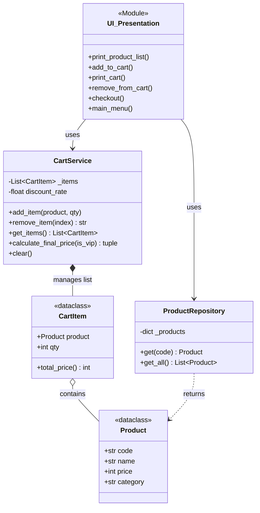

```mermaid
classDiagram
    %% 1. 데이터 구조 (DTO)
    class Product {
        <<dataclass>>
        +str code
        +str name
        +int price
        +str category
    }

    class CartItem {
        <<dataclass>>
        +Product product
        +int qty
        +total_price() int
    }

    %% 2. 비즈니스 로직 및 저장소
    class ProductRepository {
        -dict _products
        +get(code) Product
        +get_all() List~Product~
    }

    class CartService {
        -List~CartItem~ _items
        -float discount_rate
        +add_item(product, qty)
        +remove_item(index) str
        +get_items() List~CartItem~
        +calculate_final_price(is_vip) tuple
        +clear()
    }

    %% 3. 프레젠테이션 (UI 함수 모음)
    class UI_Presentation {
        <<Module>>
        +print_product_list()
        +add_to_cart()
        +print_cart()
        +remove_from_cart()
        +checkout()
        +main_menu()
    }

    %% 관계 정의 (Relationships)
    
    %% CartItem은 Product를 포함함 (Association)
    CartItem o-- Product : contains
    
    %% Repository는 Product를 관리/반환함 (Dependency)
    ProductRepository ..> Product : returns

    %% Service는 CartItem 리스트를 관리함 (Composition)
    CartService *-- CartItem : manages list

    %% UI는 Service와 Repository를 사용함 (Dependency/Unidirectional)
    UI_Presentation --> CartService : uses
    UI_Presentation --> ProductRepository : uses
```
