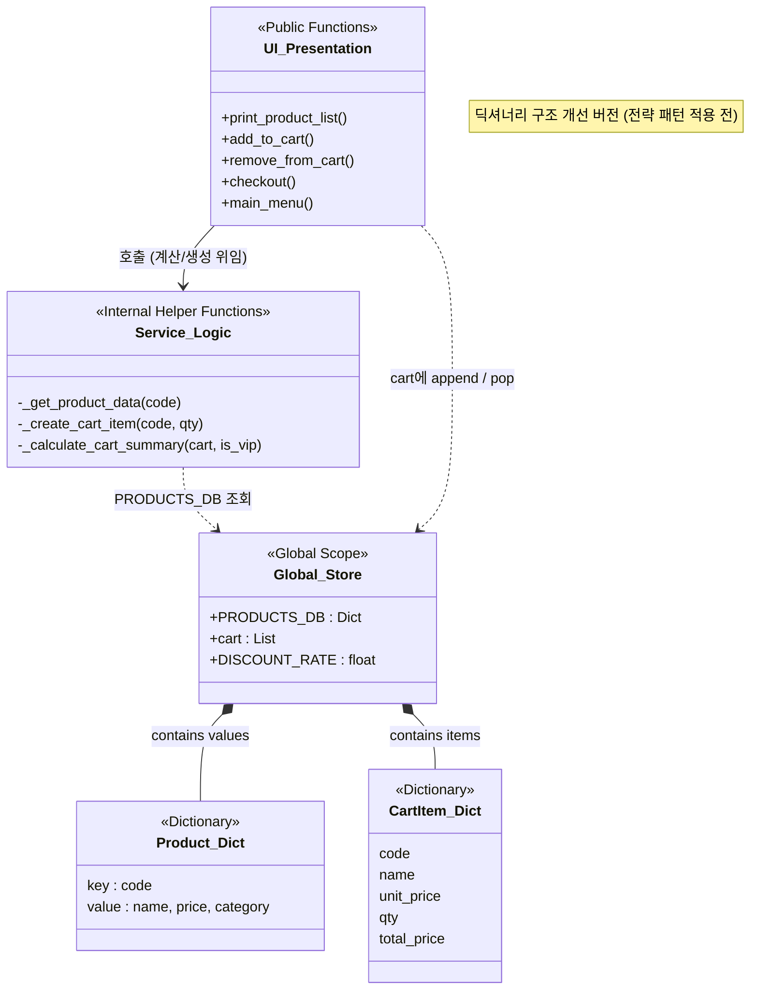

```mermaid
classDiagram
    note "딕셔너리 구조 개선 버전 (전략 패턴 적용 전)"

    %% 1. 데이터 스키마 (암시적 구조)
    class Product_Dict {
        <<Dictionary>>
        key : code
        value : name, price, category
    }

    class CartItem_Dict {
        <<Dictionary>>
        code
        name
        unit_price
        qty
        total_price
    }

    %% 2. 전역 데이터 저장소
    class Global_Store {
        <<Global Scope>>
        +PRODUCTS_DB : Dict
        +cart : List
        +DISCOUNT_RATE : float
    }

    %% 3. 비즈니스 로직 (순수 함수 그룹)
    class Service_Logic {
        <<Internal Helper Functions>>
        -_get_product_data(code)
        -_create_cart_item(code, qty)
        -_calculate_cart_summary(cart, is_vip)
    }

    %% 4. 프레젠테이션 (UI 함수 그룹)
    class UI_Presentation {
        <<Public Functions>>
        +print_product_list()
        +add_to_cart()
        +remove_from_cart()
        +checkout()
        +main_menu()
    }

    %% 관계 정의 (Relationships)

    UI_Presentation --> Service_Logic : 호출 (계산/생성 위임)
    Service_Logic ..> Global_Store : PRODUCTS_DB 조회
    UI_Presentation ..> Global_Store : cart에 append / pop

    Global_Store *-- Product_Dict : contains values
    Global_Store *-- CartItem_Dict : contains items
```
