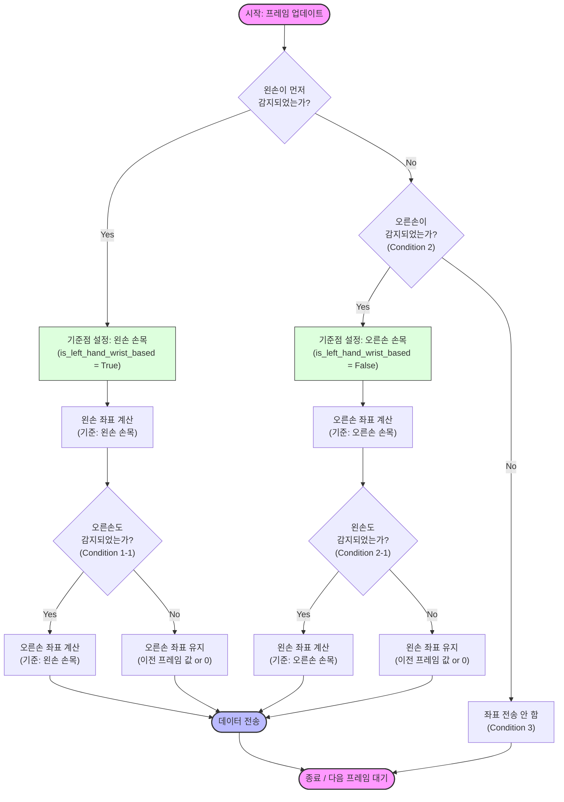

```mermaid
flowchart TD
    %% 시작 노드
    Start(["시작: 프레임 업데이트"]) --> CheckLeft{"왼손이 먼저<br>감지되었는가?"}

    %% [분기 1] 왼손 감지됨 (왼손 우선)
    CheckLeft -- Yes --> SetLeftRef["기준점 설정: 왼손 손목<br>(is_left_hand_wrist_based = True)"]
    SetLeftRef --> CalcLeft["왼손 좌표 계산<br>(기준: 왼손 손목)"]
    CalcLeft --> CheckRightSub{"오른손도<br>감지되었는가?<br>(Condition 1-1)"}

    %% [분기 1-1] 왼손 기준 + 오른손 있음/없음
    CheckRightSub -- Yes --> CalcRightRelLeft["오른손 좌표 계산<br>(기준: 왼손 손목)"]
    CheckRightSub -- No --> KeepRightPrev["오른손 좌표 유지<br>(이전 프레임 값 or 0)"]

    %% [분기 2] 왼손 없음 -> 오른손 확인
    CheckLeft -- No --> CheckRight{"오른손이<br>감지되었는가?<br>(Condition 2)"}

    %% [분기 2-1] 오른손만 감지됨 (오른손 기준)
    CheckRight -- Yes --> SetRightRef["기준점 설정: 오른손 손목<br>(is_left_hand_wrist_based = False)"]
    SetRightRef --> CalcRight["오른손 좌표 계산<br>(기준: 오른손 손목)"]
    CalcRight --> CheckLeftSub{"왼손도<br>감지되었는가?<br>(Condition 2-1)"}

    %% [분기 2-2] 오른손 기준 + 왼손 있음/없음
    CheckLeftSub -- Yes --> CalcLeftRelRight["왼손 좌표 계산<br>(기준: 오른손 손목)"]
    CheckLeftSub -- No --> KeepLeftPrev["왼손 좌표 유지<br>(이전 프레임 값 or 0)"]

    %% [분기 3] 아무 손도 없음
    CheckRight -- No --> NoHands["좌표 전송 안 함<br>(Condition 3)"]

    %% 데이터 전송 및 종료 병합
    CalcRightRelLeft --> SendData(["데이터 전송"])
    KeepRightPrev --> SendData
    CalcLeftRelRight --> SendData
    KeepLeftPrev --> SendData
    
    NoHands --> EndNode(["종료 / 다음 프레임 대기"])
    SendData --> EndNode

    %% 스타일링
    style Start fill:#f9f,stroke:#333,stroke-width:2px
    style EndNode fill:#f9f,stroke:#333,stroke-width:2px
    style SendData fill:#bbf,stroke:#333,stroke-width:2px
    style SetLeftRef fill:#dfd,stroke:#333
    style SetRightRef fill:#dfd,stroke:#333
```
